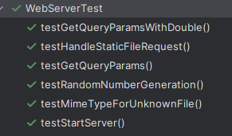

# Servidor Web hecho en Java

Este proyecto tiene como objetivo mejorar un servidor web existente, el cual actualmente admite archivos HTML, JavaScript, CSS e imágenes, para convertirlo en un framework web completo. Este nuevo framework permitirá el desarrollo de aplicaciones web con servicios backend basados en REST. Para ello, proporcionará herramientas que facilitarán a los desarrolladores la definición de servicios REST mediante funciones lambda, la gestión de valores de consulta dentro de las solicitudes y la especificación de la ubicación de archivos estáticos.

## Autor

* **Nicolas Bernal** - Autor y Desarrollador del Proyecto

### Paso a paso para la instalacion, compilacion y ejecucion del proyecto

Clona este repositorio y navega al directorio donde clonaste el proyecto:

```
git clone https://github.com/NicoBernal19/Taller2AREP.git
```

Construte y tambien compila el proyecto con Maven:

```
mvn clean install
```

Ejecuta la aplicacion, corre la clase principal para iniciar el servidor:

```
mvn exec:java -Dexec.mainClass="co.edu.eci.arep.WebFramework"
```

El servidor esta hecho para que inicie en el puerto `35000`, una vez ejecutado, ya esta listo para que puedas usarlo y probarlo.

## Funcionalidades del servidor

El código está estructurado en diferentes archivos para no tener una sola clase llena de codigo, ademas de que es una buena practica y permite que todo este mas ordenado y compacto, hace que sea mas facil extender a posterior el codigo.

Entre las funcionalidades que se ofrecen encontramos las siguientes:

- Soporta los métodos `GET` y `POST`.
- Permite servir HTML, CSS, JS e imágenes.
- Hace uso de funciones Lambda.

## Pruebas

### Pruebas Unitarias

Antes que nada debo dejar claro que hay algunas pruebas que requieren que el servidor este corriendo para que funcionen, por lo tanto sugiero ejecutar primero el servidor y luego si ejecutar las pruebas.

Para poder ejecutar las pruebas con las que cuenta este proyecto ejecuta el siguiente comando:

```
mvn test
```

A continuacion se encuentran imagenes de la ejecucion de las pruebas:





### Pruebas en tiempo real

Abre el navegador para poder probar el servidor y accede al siguiente enlace:

```
http://localhost:35000
```

Una vez abierto el servidor web puedes navegar la pagina, probando las distintas funcionalidades. A continuacion encontramos algunos ejemplos de acciones que se pueden hacer:


Tambien puedes ir al siguiente enlace (o uno similar) para probar la funcionalidad del saludo:

```
http://localhost:35000/App/hello?name=nicolas
```

### Pruebas archivos estáticos

Prueba a acceder a los siguientes archivos:

```
http://localhost:35000/index.html
http://localhost:35000/static/script.js
http://localhost:35000/static/styles.css
http://localhost:35000/images/realMadrid.png
```
